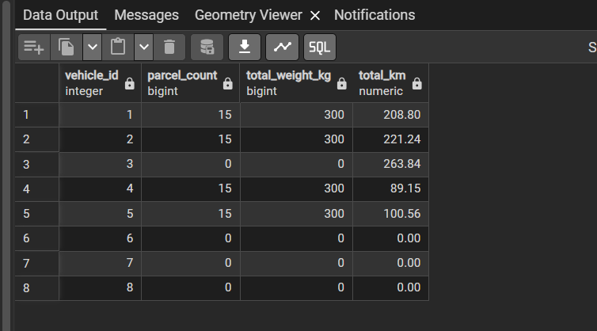

# 🚚 Vehicle Routing Optimization System

A full-stack web application for optimizing vehicle routing with **Google Route Optimization API**, **live traffic integration**, weather simulation, real-time visualization, and delivery fleet management — built with React, FastAPI, PostgreSQL/PostGIS, pgRouting, and multi-source traffic APIs.


## 📋 Table of Contents

- [Overview](#overview)
- [Features](#features)
- [Technology Stack](#technology-stack)
- [Project Structure](#project-structure)
- [Prerequisites](#prerequisites)
- [Installation](#installation)
- [Configuration](#configuration)
- [Usage](#usage)
- [API Documentation](#api-documentation)
- [Database Schema](#database-schema)
- [Deployment](#deployment)
- [Contributing](#contributing)
- [License](#license)

> **📖 For Developers**: See [ARCHITECTURE.md](ARCHITECTURE.md) for detailed system architecture, data flow diagrams, and how the optimization process works.

## 🎯 Overview

This Vehicle Routing Optimization System solves the Vehicle Routing Problem (VRP) with time windows and capacity constraints for logistics operations in Maharashtra, India. The system:

- **Optimizes** delivery routes for 10 vehicles using Google Route Optimization API (OAuth2) with OR-Tools fallback
- **Integrates** real-time traffic data from Google Routes API / TomTom / weather simulation
- **Calculates** actual road distances using pgRouting on OpenStreetMap data
- **Visualizes** routes on an interactive map with traffic-colored segments (🟢🟡🟠🔴)
- **Enforces** vehicle capacity constraints with delivery-only mode (utilization ≤ 100%)
- **Manages** vehicle capacity, time windows, and service times
- **Models** realistic departure times with warehouse loading buffers
- **Provides** real-time statistics and route analytics

### Key Capabilities

- Upload delivery data via CSV/Excel with automatic geocoding (Ola Maps + Nominatim fallback)
- Edit parcel details (weight, time windows, service time)
- Configure warehouse location
- Compute optimal routes with capacity and time constraints
- **🆕 Dynamic Fleet Configuration** — adjust shift times and vehicle capacities on-the-fly in the UI
- **🆕 Live Data Editing** — edit parcel weights and delivery windows directly in the preview table
- **🆕 100% Accurate Road Times** — travel times calculated using real road speeds (seconds) from pgRouting
- **🆕 Overnight Shift Support** — robustly handles shifts starting one day and ending the next (e.g., 8:00 AM to 01:00 AM)
- **🆕 Monsoon Simulation** — test route adjustments and waterlogging avoidance with `WEATHER_SIMULATE_RAIN=true`
- **🆕 Google Route Optimization** — OAuth2 Service Account for industrial-grade VRP solving
- **🆕 Multi-source traffic** — Google Routes API + TomTom + weather simulation
- **🆕 Delivery-only capacity** — ensures vehicle utilization never exceeds 100%
- **🆕 Refresh Traffic** — re-query congestion and re-generate route geometry on demand
- **🆕 Traffic visualization** — color-coded route segments by congestion level
- **🆕 AI Chatbot** — Gemini-powered analytics assistant on Results page (ask about routes, vehicles, parcels, weather)
- View routes on interactive map with actual road geometries
- Track vehicle utilization, costs, and schedules
- Download formatted Excel reports with delivery details
- Identify undelivered parcels with detailed reasons

## ✨ Features

### 🎨 Frontend Features

#### 1. Upload & Data Management
- **Drag-and-Drop Upload**: Modern file upload interface supporting CSV and Excel formats
- **Automatic Geocoding**: Converts addresses to coordinates using Ola Maps API (with Nominatim/OpenStreetMap fallback)
- **Editable Data Table**: Interactive table with inline editing for all delivery parameters
- **Data Validation**: Real-time validation of uploaded data
- **Warehouse Configuration**: Set custom warehouse location (default: Mumbai)

#### 2. Route Visualization
- **Interactive Map**: MapTiler-powered map with zoom, pan, and marker interactions
- **Color-Coded Routes**: 10 distinct colors for up to 10 vehicles
- **Road-Based Paths**: Actual road geometries from pgRouting (not straight lines)
- **Direction Arrows**: Visual indicators showing route direction
- **Enhanced Visibility**: Darker, thicker route lines for better clarity
- **🆕 Selective Route Visibility**: Toggle individual vehicle routes with checkboxes
  - Click checkboxes in legend to show/hide specific routes
  - "Show All" / "Hide All" buttons for bulk control
  - Synchronized route and marker visibility
- **🆕 Live Traffic Visualization**: Per-segment congestion coloring on vehicle routes
  - 🟢 Green — Free flow (traffic factor ≤ 1.1×)
  - 🟡 Yellow — Light congestion (1.1×–1.5×)
  - 🟠 Orange — Moderate congestion (1.5×–2.0×)
  - 🔴 Red — Heavy congestion (> 2.0×)
  - ON/OFF toggle in map legend
  - Congested segments render thicker (7px) for emphasis

#### 3. Statistics Dashboard
- **Summary Cards**: Total distance, cost, parcels, and active fleets
- **Vehicle Breakdown**: Expandable cards showing:
  - Distance traveled and operational cost
  - Weight carried vs capacity
  - Utilization percentage with visual bar
  - Clock-in and clock-out times
  - Work duration
  - Complete stop list with arrival times and status
- **Undelivered Parcels**: Separate section highlighting unassigned deliveries
- **Excel Report Download**: Formatted Excel file with color-coded delivery status
- **🆕 Unassigned Parcels Sheet**: Dedicated Excel sheet showing:
  - Parcels that couldn't be assigned to any vehicle
  - Detailed reasons for non-assignment
  - Parcel location and weight information
  - Red-themed header for easy identification

### 🔧 Backend Features

#### API Endpoints
- `GET /api/health` - Health check
- `POST /api/upload` - Upload CSV/Excel delivery data with automatic geocoding
- `POST /api/update-data` - Update edited delivery data
- `POST /api/warehouse` - Configure warehouse location
- `POST /api/compute` - Trigger route optimization
- `GET /api/results` - Retrieve optimized routes and statistics
- `GET /api/download-report` - Download Excel report with delivery details
- **🆕** `POST /api/refresh-traffic` - Re-query traffic/weather, re-generate routes, detect reroutes

#### Optimization Engine
- **Google Route Optimization API** (Primary): OAuth2 Service Account, delivery-only capacity mode
- **OR-Tools VRP Solver** (Fallback): Capacity and time window constraints
- **pgRouting Integration**: Real-world distance matrix calculation
- **Database Operations**: PostgreSQL/PostGIS for spatial data
- **Route Geometry**: Per-segment MultiLineString geometries with traffic factors
- **🆕 Multi-Source Traffic**: Google Routes API + TomTom + Weather Simulation
- **🆕 Weather Simulation**: Deterministic monsoon simulation (~40% rain coverage)
- **🆕 Realistic Time Modeling**: 10-min warehouse loading buffer + accurate travel time rounding

## 🛠️ Technology Stack

### Frontend
| Technology | Version | Purpose |
|------------|---------|---------|
| React | 18.3.1 | UI framework |
| TypeScript | 5.6.3 | Type safety |
| Vite | 6.0.3 | Build tool & dev server |
| Tailwind CSS | 3.4.17 | Styling framework |
| React Router | 6.28.0 | Client-side routing |
| Axios | 1.7.9 | HTTP client |
| MapTiler SDK | 2.3.0 | Map visualization |

### Backend
| Technology | Version | Purpose |
|------------|---------|---------|
| FastAPI | 0.115.0 | Web framework |
| Uvicorn | 0.32.0 | ASGI server |
| Pandas | 2.2.3 | Data processing |
| psycopg2-binary | 2.9.10 | PostgreSQL adapter |
| OR-Tools | 9.11.4210 | Route optimization |
| openpyxl | 3.1.5 | Excel file generation |
| python-dotenv | 1.0.1 | Environment management |

### Database
- **PostgreSQL** 13+ with **PostGIS** and **pgRouting** extensions
- Road network data from OpenStreetMap (Maharashtra)

## 📁 Project Structure

```
GisTransportation4/
├── backend/
│   ├── main.py                 # FastAPI application
│   ├── database.py             # PostgreSQL operations
│   ├── vrp_solver.py           # VRP orchestration (Google + OR-Tools)
│   ├── google_solver.py        # Google Route Optimization API (OAuth2)
│   ├── traffic_service.py      # Multi-source traffic (Google/TomTom)
│   ├── weather_service.py      # OpenWeatherMap + monsoon simulation
│   ├── report_generator.py     # Excel report generation
│   ├── requirements.txt        # Python dependencies
│   ├── .env                    # Environment variables (not in git)
│   └── .gitignore
│
├── frontend/
│   ├── src/
│   │   ├── components/
│   │   │   ├── MapView.tsx    # Map visualization
│   │   │   └── StatsPanel.tsx # Statistics dashboard
│   │   ├── pages/
│   │   │   ├── UploadPage.tsx # Upload & edit page
│   │   │   └── ResultsPage.tsx # Results page
│   │   ├── services/
│   │   │   └── api.ts         # API service layer
│   │   ├── types/
│   │   │   └── api.ts         # TypeScript interfaces
│   │   ├── App.tsx            # Router configuration
│   │   ├── main.tsx           # Entry point
│   │   └── index.css          # Global styles
│   ├── package.json
│   ├── vite.config.ts
│   ├── tailwind.config.js
│   ├── .env                    # Environment variables (not in git)
│   └── .gitignore
│
├── README.md
└── .gitignore
```

## 📦 Prerequisites

- **Node.js** 18+ and npm
- **Python** 3.9+
- **PostgreSQL** 13+ with PostGIS and pgRouting extensions
- **MapTiler API Key** (free tier available at [maptiler.com](https://www.maptiler.com))

## 🚀 Installation

### 1. Clone the Repository

```bash
git clone https://github.com/Rohan-Ghadage-AIQ/Gis_transportation.git
cd GisTransportation4
```

### 2. Backend Setup

```bash
cd backend

# Create virtual environment 
python -m venv venv 

# Activate virtual environment
# Windows:
venv\Scripts\activate
# Linux/Mac:
source venv/bin/activate

# Install dependencies
pip install -r requirements.txt
```

### 3. Frontend Setup

```bash
cd frontend

# Install dependencies
npm install
```

## ⚙️ Configuration

### Backend Configuration

Create `backend/.env` file:

```env
# Database Configuration
DB_NAME=your_database_name
DB_USER=your_username
DB_PASSWORD=your_password
DB_HOST=your_host
DB_PORT=5432

# Server Configuration
HOST=0.0.0.0
PORT=8000
FRONTEND_URL=http://localhost:5173

# API Keys
TOMTOM_API_KEY=your_tomtom_api_key           # Live traffic data (optional, https://developer.tomtom.com/)
KRUTRIM_API_KEY=your_ola_maps_api_key        # Geocoding (Ola Maps — api.olamaps.io)
USE_KRUTRIM_GEOCODING=true                   # Set false to use Nominatim only
GOOGLE_MAPS_API_KEY=your_google_api_key      # Google Routes API traffic

# Google Route Optimization (OAuth2 Service Account)
USE_GOOGLE_OPTIMIZATION=true
GOOGLE_PROJECT_ID=your-project-id
GOOGLE_SERVICE_ACCOUNT_JSON=your-sa-file.json

# Traffic & Weather
TRAFFIC_SOURCE=google                         # 'google' or 'tomtom'
WEATHER_SIMULATE_RAIN=true                    # Simulate monsoon at ~40% of stations
OPENWEATHER_API_KEY=your_owm_key              # Real weather data

# AI Chatbot
GEMINI_API_KEY=your_gemini_api_key            # From https://aistudio.google.com/
```

### Frontend Configuration

Create `frontend/.env` file:

```env
VITE_API_URL=http://localhost:8000
VITE_MAPTILER_KEY=your_maptiler_api_key
```
### OR
### Docker Setup
Make the .env files in the backend and frontend folders.
Go to GisTransportation4 folder

```bash
cd GisTransportation4
```

```bash
docker-compose up --build
```


### Database Setup

Your PostgreSQL database should have:

1. **PostGIS Extension**:
```sql
CREATE EXTENSION IF NOT EXISTS postgis;
CREATE EXTENSION IF NOT EXISTS pgrouting;
```

2. **Required Tables**:
   - `vector.station_node_map` - Delivery stations
   - `vector.road_maharashtra` - Road network
   - `vector.distance_matrix` - Precomputed distances
   - `vector.route_geometries` - Route paths

## 🎮 Usage

### Starting the Application

#### Option 1: Manual Start

**Terminal 1 - Backend:**
```bash
cd backend
venv\Scripts\activate  # Windows
# source venv/bin/activate  # Linux/Mac
python main.py
```

**Terminal 2 - Frontend:**
```bash
cd frontend
npm run dev
```

#### Option 2: Quick Start (Windows)

```bash
start.bat
```

### Accessing the Application

- **Frontend**: http://localhost:5173 (or http://localhost:5174 if 5173 is in use)
- **Backend API**: http://localhost:8000
- **API Documentation**: http://localhost:8000/docs (Swagger UI)

### Workflow

1. **Upload Data**
   - Navigate to http://localhost:5173
   - Upload CSV/Excel file with columns: `id`, `latitude`, `longitude`
   - Optional columns: `parcel_weight`, `service_time`, `window_start`, `window_end`

2. **Edit Data** (Optional)
   - Click any cell in the data table to edit
   - Modify parcel weights, service times, or time windows
   - Changes are saved automatically

3. **Configure Warehouse** (Optional)
   - Default: Mumbai (19.0725, 72.8724)
   - Can be customized via API

4. **Compute Routes**
   - Click "Compute Optimal Routes"
   - Backend performs:
      - Data insertion to database
      - Distance matrix calculation via pgRouting
      - Traffic + weather sync (Google/TomTom + simulation)
      - VRP optimization with Google Route Optimization (or OR-Tools fallback)
      - Route geometry generation with traffic colors
   - Processing time: ~35-45 seconds for 56 deliveries

5. **View Results**
   - **Map**: Color-coded routes with actual road paths
   - **Statistics**: Vehicle details, costs, utilization
   - **Undelivered**: Any parcels that couldn't be assigned

## 📚 API Documentation

### Upload File

```http
POST /api/upload
Content-Type: multipart/form-data

Body: file (CSV/Excel)

Response:
{
  "status": "success",
  "message": "File uploaded successfully",
  "data": [...],
  "columns": [...],
  "row_count": 50
}
```

### Compute Routes

```http
POST /api/compute

Response:
{
  "status": "success",
  "message": "Route optimization completed. 8 vehicles used for 53 deliveries."
}
```

### Get Results

```http
GET /api/results

Response:
{
  "vehicles": [
    {
      "vehicle_id": 1,
      "stations": [...],
      "route_geometry": [...],
      "total_distance": 71.88,
      "total_cost": 1078.2,
      "weight_carried": 174,
      "capacity": 175,
      "utilization": 99.4,
      "work_duration": 143,
      "color": "#FF6B6B",
      "clock_in": "09:00 AM",
      "clock_out": "11:23 AM"
    },
    ...
  ],
  "summary": {
    "total_distance": 676.21,
    "total_cost": 9723.30,
    "total_parcels": 53,
    "total_fleets": 8,
    "warehouse": {...}
  },
  "parcels": [...],
  "undelivered_parcels": [...]
}
```

## 🗄️ Database Schema

### vector.station_node_map

Stores delivery station information and vehicle assignments.

```sql
CREATE TABLE vector.station_node_map (
    station_id INTEGER PRIMARY KEY,
    nearest_node_id BIGINT,
    geom GEOMETRY(Point, 4326),
    parcel_weight INTEGER,
    service_time INTEGER,
    window_start INTEGER,
    window_end INTEGER,
    vehicle_id INTEGER
);
```

### vector.route_geometries

Stores per-segment route paths with traffic data for color-coded visualization.

```sql
CREATE TABLE vector.route_geometries (
    vehicle_id INTEGER,
    segment_index INTEGER DEFAULT 0,        -- Stop-pair order (0, 1, 2...)
    geom GEOMETRY,                          -- Road geometry for this segment
    avg_traffic_factor REAL DEFAULT 1.0     -- TomTom congestion factor (1.0 = free flow)
);
```

### vector.road_maharashtra (traffic columns)

```sql
-- Added by update_schema_traffic.sql
ALTER TABLE vector.road_maharashtra 
    ADD COLUMN IF NOT EXISTS traffic_factor DOUBLE PRECISION DEFAULT 1.0,
    ADD COLUMN IF NOT EXISTS live_cost_s DOUBLE PRECISION;  -- cost_s × traffic_factor
```

## 🎨 Color Scheme

Vehicle routes use distinct colors for easy identification:

| Vehicle | Color | Hex Code |
|---------|-------|----------|
| Vehicle 1 | Red | #FF6B6B |
| Vehicle 2 | Teal | #4ECDC4 |
| Vehicle 3 | Blue | #45B7D1 |
| Vehicle 4 | Orange | #FFA07A |
| Vehicle 5 | Mint | #98D8C8 |
| Vehicle 6 | Yellow | #F7DC6F |
| Vehicle 7 | Purple | #BB8FCE |
| Vehicle 8 | Light Blue | #85C1E2 |

## 🚀 Deployment

### Backend Deployment

1. Set up PostgreSQL database with PostGIS and pgRouting
2. Load road network data (OpenStreetMap)
3. Configure environment variables
4. Deploy using:
   - Docker container
   - Cloud services (AWS, Azure, GCP)
   - Traditional server with systemd

### Frontend Deployment

```bash
cd frontend
npm run build
```

Deploy the `dist/` folder to:
- Netlify
- Vercel
- AWS S3 + CloudFront
- Any static hosting service

##  Acknowledgments

- **Google Route Optimization API** for industrial-grade VRP solving
- **Google OR-Tools** for the VRP solver (fallback)
- **pgRouting** for road network routing
- **MapTiler** for map visualization
- **OpenStreetMap** contributors for road data
- **Google Routes API** for real-time traffic data
- **TomTom** for real-time traffic data API (alternative)
- **OpenWeatherMap** for weather data and monsoon simulation
- **Ola Maps (Krutrim)** for geocoding API

