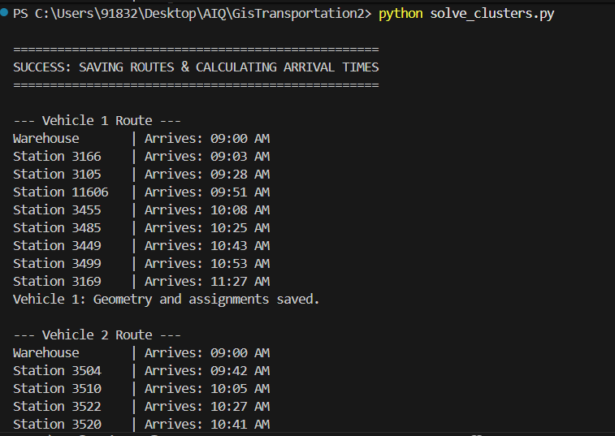
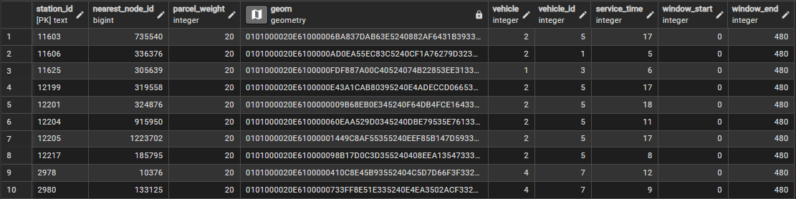

```
-- Updated Query - SQL
-- 1. Reset the Mapping Table
DROP TABLE IF EXISTS vector.station_node_map CASCADE;
CREATE TABLE vector.station_node_map (
    station_id TEXT PRIMARY KEY,
    nearest_node_id BIGINT,
    parcel_weight INT DEFAULT 20,
    geom geometry(Point, 4326)
);

-- 2. Populate from your current sample table (e.g., sample_1_data)
-- This logic snaps your 60 points to the main road network (Component 11)
INSERT INTO vector.station_node_map (station_id, nearest_node_id, geom)
SELECT 
    id,
    (SELECT m.node 
     FROM pgr_connectedComponents('SELECT gid AS id, source, target, cost FROM vector.road_maharashtra') m
     JOIN vector.road_maharashtra r ON (r.source = m.node OR r.target = m.node)
     WHERE m.component = 11 
     ORDER BY r.geom <-> s.geom LIMIT 1),
    geom
FROM vector.sample_1_data s; -- Change this table name for switching data

-----------------------------------------------------

-- 1. Clear the old matrix
TRUNCATE TABLE vector.distance_matrix;
-- Insert data into distance matrix
-- 2. Calculate costs between all nodes currently in the map (60 + Warehouse)
INSERT INTO vector.distance_matrix (start_vid, end_vid, agg_cost)
SELECT start_vid, end_vid, agg_cost
FROM pgr_dijkstraCost(
    'SELECT gid AS id, source, target, cost FROM vector.road_maharashtra',
    (SELECT ARRAY_AGG(DISTINCT nearest_node_id) FROM vector.station_node_map) 
    || (SELECT m.node FROM pgr_connectedComponents('SELECT gid AS id, source, target, cost FROM vector.road_maharashtra') m 
        JOIN vector.road_maharashtra r ON (r.source = m.node OR r.target = m.node)
        WHERE m.component = 11 ORDER BY r.geom <-> ST_SetSRID(ST_Point(72.8724, 19.0725), 4326) LIMIT 1),
    (SELECT ARRAY_AGG(DISTINCT nearest_node_id) FROM vector.station_node_map) 
    || (SELECT m.node FROM pgr_connectedComponents('SELECT gid AS id, source, target, cost FROM vector.road_maharashtra') m 
        JOIN vector.road_maharashtra r ON (r.source = m.node OR r.target = m.node)
        WHERE m.component = 11 ORDER BY r.geom <-> ST_SetSRID(ST_Point(72.8724, 19.0725), 4326) LIMIT 1),
    directed := false
);
------------------------------------------
SELECT * FROM vector.distance_matrix;
----------------
SELECT * FROM vector.final_station_clusters;
----------------
SELECT * FROM vector.route_geometries;
----------------
-- This query checks how many distance pairs exist for the stations currently in your map
SELECT 
    (SELECT COUNT(*) FROM vector.station_node_map) as stations_in_map,
    COUNT(dm.*) as matching_distances_found
FROM vector.distance_matrix dm
WHERE dm.start_vid IN (SELECT nearest_node_id FROM vector.station_node_map)
  AND dm.end_vid IN (SELECT nearest_node_id FROM vector.station_node_map);

  -------

  SELECT COUNT(*) FROM vector.distance_matrix 
WHERE start_vid = 175614 OR end_vid = 175614;

---------------

SELECT 
    cluster_id AS vehicle_id,
    COUNT(station_id) AS parcel_count,
    SUM(weight) AS total_weight_kg
FROM vector.final_station_clusters
GROUP BY cluster_id
ORDER BY cluster_id;

------------------------
-- Run all queries till here after this run the python script and then below query

SELECT 
    v.id AS vehicle_id,
    COUNT(DISTINCT f.station_id) AS parcel_count,
    COALESCE(SUM(f.weight), 0) AS total_weight_kg,
    ROUND((SELECT COALESCE(SUM(ST_Length(geom::geography))/1000, 0) 
           FROM vector.route_geometries 
           WHERE vehicle_id = v.id)::numeric, 2) AS total_km
FROM (SELECT generate_series(1,8) AS id) v 
LEFT JOIN vector.final_station_clusters f ON v.id = f.cluster_id
GROUP BY v.id
ORDER BY v.id;

```
### Run the script solve_clusters.py
## see output in console


## run the last block of SQL query 


## Updated logic - output 


## After Adding Time window constraints


# Run this query to get overview of vehicle id, time window, service time window
```
SELECT * FROM vector.station_node_map
ORDER BY station_id ASC 
```


# Final Console Output 
```
PS C:\Users\91832\Desktop\AIQ\GisTransportation2> python solve_clusters.py
 
==================================================
SUCCESS: SAVING ROUTES & CALCULATING ARRIVAL TIMES
==================================================
 
--- Vehicle 1 Route ---
Warehouse (Start) | Clock-in: 09:00 AM
Warehouse       | Arrives: 09:00 AM
Station 3166    | Arrives: 09:03 AM
Station 3661    | Arrives: 10:33 AM
Station 3666    | Arrives: 10:47 AM
Station 3597    | Arrives: 11:04 AM
Station 3657    | Arrives: 11:28 AM
Station 3566    | Arrives: 11:54 AM
Station 3562    | Arrives: 12:14 PM
Station 3588    | Arrives: 12:36 PM
Warehouse (End) | Arrives: 01:53 PM
Total Work Duration: 293 minutes [ON TIME]
Vehicle 1: Geometry and assignments saved.
 
--- Vehicle 2 Route ---
Warehouse (Start) | Clock-in: 09:00 AM
Warehouse       | Arrives: 09:00 AM
Station 3025    | Arrives: 09:16 AM
Station 3067    | Arrives: 09:29 AM
Station 3061    | Arrives: 09:40 AM
Station 3046    | Arrives: 10:00 AM
Station 3063    | Arrives: 10:09 AM
Station 3135    | Arrives: 10:43 AM
Station 3132    | Arrives: 10:57 AM
Warehouse (End) | Arrives: 11:13 AM
Total Work Duration: 133 minutes [ON TIME]
Vehicle 2: Geometry and assignments saved.
 
--- Vehicle 3 Route ---
Warehouse (Start) | Clock-in: 07:00 AM
Warehouse       | Arrives: 07:00 AM
Station 3504    | Arrives: 07:42 AM
Station 3510    | Arrives: 08:05 AM
Station 3535    | Arrives: 08:32 AM
Station 3546    | Arrives: 08:46 AM
Station 3534    | Arrives: 09:09 AM
Station 3526    | Arrives: 09:16 AM
Station 3520    | Arrives: 09:35 AM
Station 3522    | Arrives: 09:58 AM
Warehouse (End) | Arrives: 11:00 AM
Total Work Duration: 240 minutes [ON TIME]
Vehicle 3: Geometry and assignments saved.
 
--- Vehicle 4 Route ---
Warehouse (Start) | Clock-in: 07:00 AM
Warehouse       | Arrives: 07:00 AM
Station 11603   | Arrives: 07:36 AM
Station 3558    | Arrives: 08:23 AM
Station 3577    | Arrives: 08:38 AM
Station 3580    | Arrives: 09:02 AM
Station 3645    | Arrives: 09:33 AM
Station 3617    | Arrives: 10:39 AM
Station 3616    | Arrives: 10:58 AM
Station 3499    | Arrives: 12:21 PM
Warehouse (End) | Arrives: 01:00 PM
Total Work Duration: 360 minutes [ON TIME]
Vehicle 4: Geometry and assignments saved.
 
--- Vehicle 5 Route ---
Warehouse (Start) | Clock-in: 09:00 AM
Warehouse       | Arrives: 09:00 AM
Station 3163    | Arrives: 09:07 AM
Station 3151    | Arrives: 09:25 AM
Station 3162    | Arrives: 09:45 AM
Station 3150    | Arrives: 10:05 AM
Station 3157    | Arrives: 10:31 AM
Station 3156    | Arrives: 10:54 AM
Warehouse (End) | Arrives: 11:15 AM
Total Work Duration: 135 minutes [ON TIME]
Vehicle 5: Geometry and assignments saved.
 
--- Vehicle 6 Route ---
Warehouse (Start) | Clock-in: 08:00 AM
Warehouse       | Arrives: 08:00 AM
Station 11606   | Arrives: 08:30 AM
Station 3629    | Arrives: 09:16 AM
Station 12204   | Arrives: 10:37 AM
Station 12205   | Arrives: 10:57 AM
Station 12217   | Arrives: 11:51 AM
Station 12201   | Arrives: 12:07 PM
Station 12199   | Arrives: 01:29 PM
Station 3052    | Arrives: 02:27 PM
Warehouse (End) | Arrives: 03:11 PM
Total Work Duration: 431 minutes [ON TIME]
Vehicle 6: Geometry and assignments saved.
 
--- Vehicle 7 Route ---
Warehouse (Start) | Clock-in: 08:00 AM
Warehouse       | Arrives: 08:00 AM
Station 3472    | Arrives: 08:39 AM
Station 3476    | Arrives: 08:46 AM
Station 3449    | Arrives: 09:19 AM
Station 3485    | Arrives: 09:33 AM
Station 3455    | Arrives: 09:54 AM
Station 11625   | Arrives: 10:11 AM
Station 3490    | Arrives: 10:18 AM
Station 3105    | Arrives: 11:00 AM
Warehouse (End) | Arrives: 11:28 AM
Total Work Duration: 208 minutes [ON TIME]
Vehicle 7: Geometry and assignments saved.
 
--- Vehicle 8 Route ---
Warehouse (Start) | Clock-in: 07:00 AM
Warehouse       | Arrives: 07:00 AM
Station 3137    | Arrives: 07:14 AM
Station 3169    | Arrives: 07:44 AM
Station 2987    | Arrives: 08:21 AM
Station 2980    | Arrives: 08:37 AM
Station 2978    | Arrives: 08:55 AM
Station 3013    | Arrives: 09:21 AM
Station 3011    | Arrives: 09:33 AM
Warehouse (End) | Arrives: 09:49 AM
Total Work Duration: 169 minutes [ON TIME]
Vehicle 8: Geometry and assignments saved.
 
Success: Balanced weight and road routes saved to database.
PS C:\Users\91832\Desktop\AIQ\GisTransportation2>
```