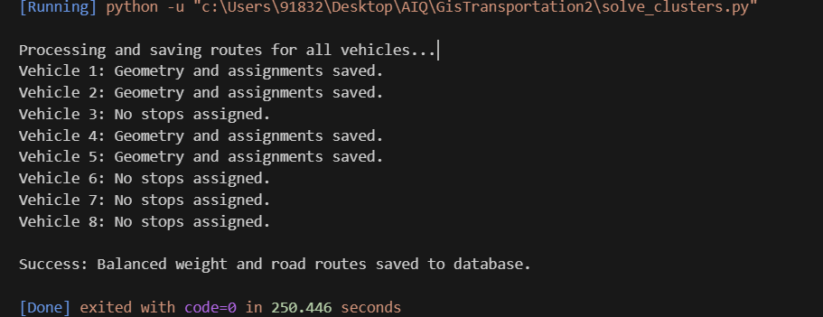
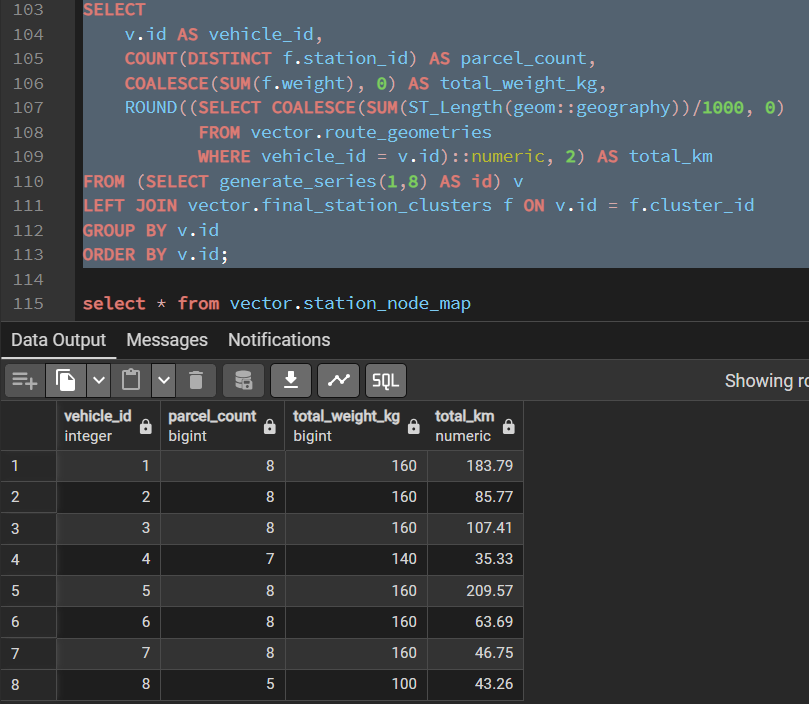

```
-- Updated Query - SQL
-- 1. Reset the Mapping Table
DROP TABLE IF EXISTS vector.station_node_map CASCADE;
CREATE TABLE vector.station_node_map (
    station_id TEXT PRIMARY KEY,
    nearest_node_id BIGINT,
    parcel_weight INT DEFAULT 20,
    geom geometry(Point, 4326)
);

-- 2. Populate from your current sample table (e.g., sample_1_data)
-- This logic snaps your 60 points to the main road network (Component 11)
INSERT INTO vector.station_node_map (station_id, nearest_node_id, geom)
SELECT 
    id,
    (SELECT m.node 
     FROM pgr_connectedComponents('SELECT gid AS id, source, target, cost FROM vector.road_maharashtra') m
     JOIN vector.road_maharashtra r ON (r.source = m.node OR r.target = m.node)
     WHERE m.component = 11 
     ORDER BY r.geom <-> s.geom LIMIT 1),
    geom
FROM vector.sample_1_data s; -- Change this table name for switching data

-----------------------------------------------------

-- 1. Clear the old matrix
TRUNCATE TABLE vector.distance_matrix;
-- Insert data into distance matrix
-- 2. Calculate costs between all nodes currently in the map (60 + Warehouse)
INSERT INTO vector.distance_matrix (start_vid, end_vid, agg_cost)
SELECT start_vid, end_vid, agg_cost
FROM pgr_dijkstraCost(
    'SELECT gid AS id, source, target, cost FROM vector.road_maharashtra',
    (SELECT ARRAY_AGG(DISTINCT nearest_node_id) FROM vector.station_node_map) 
    || (SELECT m.node FROM pgr_connectedComponents('SELECT gid AS id, source, target, cost FROM vector.road_maharashtra') m 
        JOIN vector.road_maharashtra r ON (r.source = m.node OR r.target = m.node)
        WHERE m.component = 11 ORDER BY r.geom <-> ST_SetSRID(ST_Point(72.8724, 19.0725), 4326) LIMIT 1),
    (SELECT ARRAY_AGG(DISTINCT nearest_node_id) FROM vector.station_node_map) 
    || (SELECT m.node FROM pgr_connectedComponents('SELECT gid AS id, source, target, cost FROM vector.road_maharashtra') m 
        JOIN vector.road_maharashtra r ON (r.source = m.node OR r.target = m.node)
        WHERE m.component = 11 ORDER BY r.geom <-> ST_SetSRID(ST_Point(72.8724, 19.0725), 4326) LIMIT 1),
    directed := false
);
------------------------------------------
SELECT * FROM vector.distance_matrix;
----------------
SELECT * FROM vector.final_station_clusters;
----------------
SELECT * FROM vector.route_geometries;
----------------
-- This query checks how many distance pairs exist for the stations currently in your map
SELECT 
    (SELECT COUNT(*) FROM vector.station_node_map) as stations_in_map,
    COUNT(dm.*) as matching_distances_found
FROM vector.distance_matrix dm
WHERE dm.start_vid IN (SELECT nearest_node_id FROM vector.station_node_map)
  AND dm.end_vid IN (SELECT nearest_node_id FROM vector.station_node_map);

  -------

  SELECT COUNT(*) FROM vector.distance_matrix 
WHERE start_vid = 175614 OR end_vid = 175614;

---------------

SELECT 
    cluster_id AS vehicle_id,
    COUNT(station_id) AS parcel_count,
    SUM(weight) AS total_weight_kg
FROM vector.final_station_clusters
GROUP BY cluster_id
ORDER BY cluster_id;

------------------------
-- Run all queries till here after this run the python script and then below query

SELECT 
    v.id AS vehicle_id,
    COUNT(DISTINCT f.station_id) AS parcel_count,
    COALESCE(SUM(f.weight), 0) AS total_weight_kg,
    ROUND((SELECT COALESCE(SUM(ST_Length(geom::geography))/1000, 0) 
           FROM vector.route_geometries 
           WHERE vehicle_id = v.id)::numeric, 2) AS total_km
FROM (SELECT generate_series(1,8) AS id) v 
LEFT JOIN vector.final_station_clusters f ON v.id = f.cluster_id
GROUP BY v.id
ORDER BY v.id;

```
### Run the script solve_clusters.py
## see output in console


## run the last block of SQL query 


## Updated logic - output 


